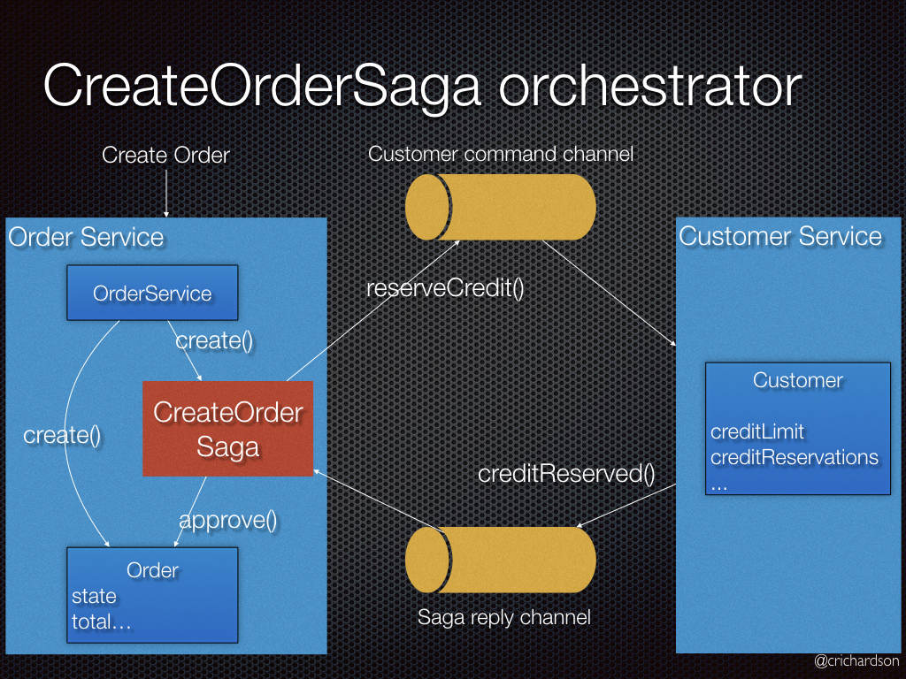
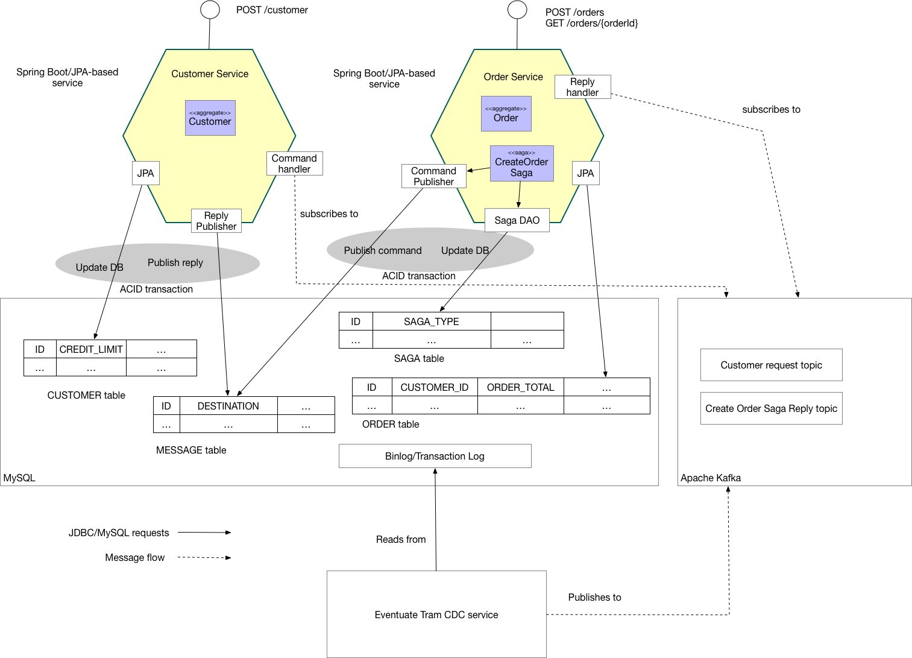

= Eventuate Tram Sagas Customers and Orders

This application  demonstrates how to maintain data consistency in an Java/JDBC/JPA-based  microservice architecture using http://microservices.io/patterns/data/saga.html[sagas].

The application consists of two services:

* `Order Service` - creates orders
* `Customer Service` - manages customers

Both services are implemented using Spring Boot, JPA and the https://github.com/eventuate-tram/eventuate-tram-sagas[Eventuate Tram Saga framework]

The `Order Service` uses a saga to enforce the customer's credit limit when creating orders.

== About sagas

http://microservices.io/patterns/data/saga.html[Sagas] are a mechanism for maintaining data consistency in a http://microservices.io/patterns/microservices.html[microservice architecture].
A saga is a sequence of transactions, each of which is local to a service.

There are two main ways to coordinate sagas: orchestration and choreography.
Please see https://github.com/eventuate-tram/eventuate-tram-examples-customers-and-orders[example] to learn about choreography-based sagas.
This example uses orchestration-based sagas, where a saga (orchestration) object invokes the participants.

A saga orchestrator is a persistent object that does one of two things:

1. On startup, it sends a command message to a participant
2. When it receives a reply, it updates its state and sends a command message to the next participant.

To learn more about why you need sagas if you are using microservices:

* the http://microservices.io/patterns/data/saga.html[Saga pattern]
* my http://microservices.io/microservices/general/2018/03/22/microxchg-sagas.html[microXchg 2018 presentation]
* read about sagas in my https://www.manning.com/books/microservice-patterns[Microservice patterns book]

== The Create Order Saga

The following diagrams shows how the saga for creating an `Order` works:



It consists of the follow steps:

. The `Order Service` creates an `Order` in a pending state
. The `Order Service` creates a `CreateOrderSaga` to coordinate the creation of the order.
. The `CreateOrderSaga` sends a `ReserveCredit` command to the `CustomerService`
. The `Customer Service` receives the command and attempts to reserve credit for that `Order`. It replies with a message indicating the outcome.
. The `CreateOrderSaga` receives the reply
. It send either an `ApproveOrder` or a `RejectOrder` command to the `OrderService`
. The `Order Service` receives the command and changes state of the order to either `approved` or `rejected`.

=== Architecture

The following diagram shows the architecture of the Customers and Orders application.



The application consists of two services:

* `Customer Service` - implements the REST endpoints for managing customers.
The service persists the `Customer` JPA entity in a MySQL/Postgres database.
Using the https://github.com/eventuate-tram/eventuate-tram-sagas[Eventuate Tram Saga framework], it processes command messages, updates its the `Customer` entity, and sends back a reply message.

* `Order Service` - implements a REST endpoint for managing orders.
The service persists the `Order` JPA entity and the `CreateOrderSaga` in MySQL/Postgres database.
Using the https://github.com/eventuate-tram/eventuate-tram-sagas[Eventuate Tram Saga framework], it sends command messages and processes replies.

The Eventuate Tram CDC service tracks inserts into the `MESSAGE` table using the MySQL binlog and publishes messages to Apache Kafka.

== Building and running

Note: you do not need to install Gradle since it will be downloaded automatically.
You just need to have Java 8 installed.

First, build the application

```
./gradlew assemble
```

Next, launch the services using https://docs.docker.com/compose/[Docker Compose]:

```
./gradlew mysqlComposeBuild
./gradlew mysqlComposeUp
```

Note:

If the containers aren't accessible via `localhost` - e.g. you are using Docker Toolbox, you will have to use `${DOCKER_HOST_IP}` instead of localhost.
See this http://eventuate.io/docs/usingdocker.html[guide to setting `DOCKER_HOST_IP`] for more information.

You can also run the Postgres version using `./gradlew postgresComposeBuild` and `./gradlew postgresComposeUp`

== Using the application

Once the application has started, you can use the application via the Swagger UI:

* `Order Service` - `http://localhost:8081/swagger-ui.html`
* `Customer Service` - `http://localhost:8082/swagger-ui.html`
* `API Gateway` - `http://localhost:8083/swagger-ui.html`

You can also use `curl` to interact with the services.
First, let's create a customer:

```bash
$ curl -X POST --header "Content-Type: application/json" -d '{
  "creditLimit": {
    "amount": 5
  },
  "name": "Jane Doe"
}' http://localhost:8082/customers

HTTP/1.1 200
Content-Type: application/json;charset=UTF-8

{
  "customerId": 1
}
```

Next, create an order:

```bash
$ curl -X POST --header "Content-Type: application/json" -d '{
  "customerId": 1,
  "orderTotal": {
    "amount": 4
  }
}' http://localhost:8081/orders

HTTP/1.1 200
Content-Type: application/json;charset=UTF-8

{
  "orderId": 1
}

```

Finally, check the status of the `Order`:

```bash
$ curl -X GET http://localhost:8081/orders/1

HTTP/1.1 200
Content-Type: application/json;charset=UTF-8

{
  "orderId": 1,
  "orderState": "APPROVED"
}
```

== Got questions?

Don't hesitate to create an issue or see

* https://groups.google.com/d/forum/eventuate-users[Mailing list]
* https://eventuate-users.slack.com[Slack]. https://eventuateusersslack.herokuapp.com/[Get invite]
* http://eventuate.io/contact.html[Contact us].
